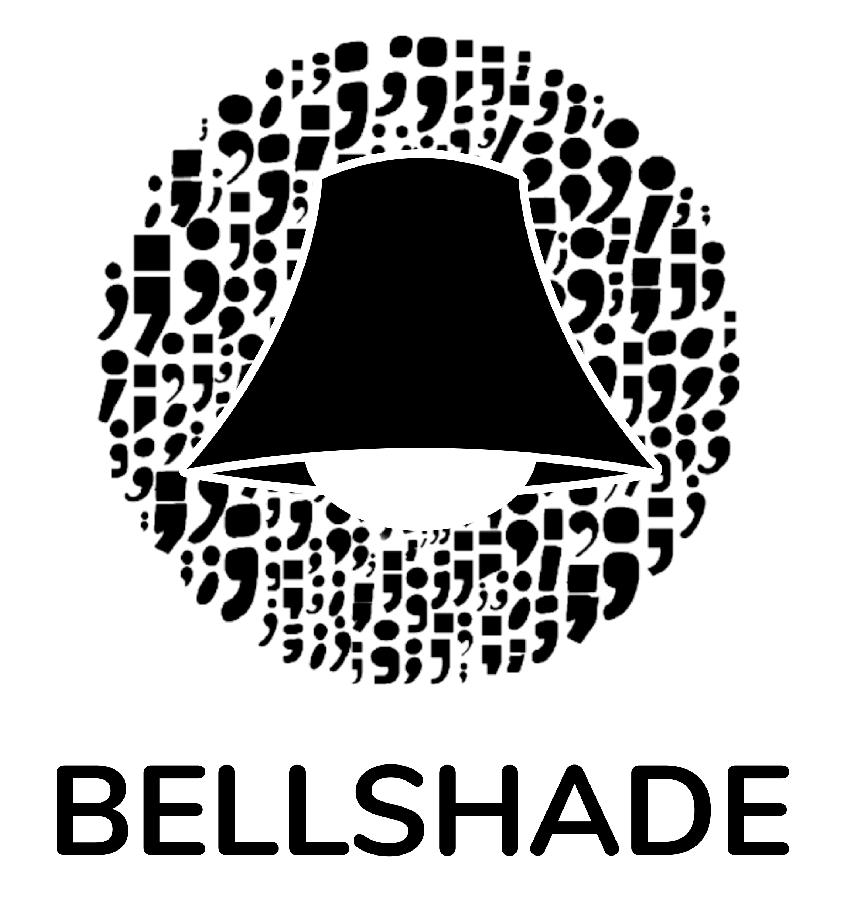

    
  Part of Bellshade Project, managed by <a href="http://discord.gg/S4rrXQU"> WPU Discord Community</a>  
  WPU Community is the fastest growing software developer forum initiated by <a href="https://www.youtube.com/c/WebProgrammingUNPAS"> Mr. Sandhika Galih</a>  
  
  
  
  
  
  
   
    

Repositori ini berisi kumpulan berbagai macam _source code_ struktur data, algoritma, analisis matematika, dan sebagainya yang diimplementasikan dengan menggunakan bahasa pemrograman Python.

## 🎉🎉 Selamat Datang di Python 🎉🎉

Python dibuat dan dikembangkan oleh Guido Van Rossum, programmer yang berasal dari Belanda. Pemilihan nama python itu sendiri diambil dari sebuah acara televisi yang lumayan terkenal yang bernama **Moth Python Flying Circus** yang merupakan acara sirkus favorit dari Guido.

Python adalah bahasa pemrograman multi paradigma, pemrogramaan berorientasi objek dan permograman terstruktur juga didukung penuh, dan banyak fiturnya mendukung pemrograman fungsional.

Kelebihan diatara python antara lain

- Mudah digunakan untuk menulis di perangkat lunak terbaru
- Mudah untuk diajarkan
- Mendukung **IoT** (**Internet of Things**)
- Mudah dipahami
- Serta mudah didapatkan, karena mudah diinstal, python juga termasuk **multiplatform**

Contoh implementasi dari bahasa pemrograman python adalah

- Komputasi ilmiah dan numerik contohnya seperti scipy
- Aplikasi bisnis seperti tryton
- Pembuatan game seperti battlefield 2
- Pengembangan web seperti django atau flask (library)
- Pengembangan dari situs web dan layanan sperti dropbox, buzfeed dan uber

### Baru Belajar? Mulai dari [sini](Basic) 🌟

Untuk menggunakan repositori dengan maksimal, kalian perlu belajar programming dasar dahulu. Silahkan ikuti alur belajar berikut untuk mempelajari dasar - dasar pemograman langsung menggunakan Python

| Langkah |              Topik               |                                  Target Pembelajaran                                  |            Materi Rujukan             |
| :-----: | :------------------------------: | :-----------------------------------------------------------------------------------: | :-----------------------------------: |
|   01    | Introduksi Pemograman dan Python | Memahami apa itu membuat program dan apa peran Python dalam proses pembuatan program  |    [Materi](Basic/01_introduction)    |
|   02    |            Tipe data             |                              Memahami apa itu tipe data                               |     [Materi](Basic/02_tipe_data)      |
|   03    |             Variabel             |                               Memahami apa itu variabel                               |      [Materi](Basic/03_variable)      |
|   04    |             Operasi              | Dapat melakukan operasi sederhana menggunakan program yang ditulis menggunakan Python |      [Materi](Basic/04_operator)      |
|   05    |              String              |                                    Memahami String                                    |       [Materi](Basic/05_string)       |
|   06    |         Input dan Output         |                        Memahami cara mengambil input dari user                        |    [Materi](Basic/06_input_output)    |
|   07    |          Pengkondisian           |  Memahami salah satu dari inti dari membuat pemograman yaitu melakukan pengkondisian  | [Materi](Basic/07_logika_percabangan) |
|   08    |            Perulangan            |            Memahami inti kedua dari pemograman yaitu melakukan perulangan             |     [Materi](Basic/08_perulangan)     |
|   09    |              Fungsi              |                    Mengenal konsep fungsi dalam teknik pemograman                     |       [Materi](Basic/09_fungsi)       |
|   10    |          List dan Tuple          |                    Memahami konsep list dan tuple secara mendalam                     |     [Materi](Basic/10_list_tuple)     |
|   11    |        Manipulasi String         |                       Memahami cara memanipulasi sebuah string                        | [Materi](Basic/11_manipulasi_string)  |
|   12    |            Exception             |                         Memahami konsep exception pada python                         |     [Materi](Basic/12_exception)      |
|   13    |              Module              |                  Memahami cara mengimport sebuah module pada python                   |       [Materi](Basic/13_module)       |
|   14    |             Datetime             |                         Mengenal module datetime pada python                          |  [Materi](Basic/14_python_datetime)   |
|   15    |               Math               |                           Mengenal module math pada python                            |    [Materi](Basic/15_python_math)     |
|   16    |              kelas               |                              Mengenal kelas pada python                               |       [Materi](Basic/16_class)        |

Setelah menyelesaikan seluruh rangkaian pengenalan dasar - dasar pemograman, kalian dapat mulai untuk mempelajari topik - topik lain yang jauh lebih seru!
Untuk sekarang, mulai saja dulu dengan [Object Oriented Programming](object_oriented_programming/README.md)

## 🎓 Topik Lanjutan 🎓

Jika kalian sudah menguasai dasar - dasar pemograman beserta dengan paradigma _Object Oriented Programming_, kalian bisa langsung mengeksplorasi topik - topik lain yang jauh lebih menantang dan tidak kalah seru. Di repositori ini, kami telah menyiapkan beberapa topik yang mungkin kamu suka.

1.  [Struktur Data](/struktur_data)

2.  [Web Programming](/web_programming)

## ⚡ Quick Access ⚡

Semua _script_ yang ada pada repositori ini, dapat diakses dengan cepat lewat link berikut:

- [Basic](Basic/README.md)
- [Algoritma](algorithm)
- [Implementasi](implementation)
  - [Blockchain](implementation/blockchain)
  - [Celular automata](implementation/celular_automata)
  - [Chiper](implementation/chiper)
  - [Compression](implementation/compression)
  - [Electro](implementation/electro)
  - [File transfer](implementation/file_transfer)
  - [Fractal](implementation/fractal)
  - [Geodesy](implementation/geodesy_programming)
  - [Physics](implementation/physics)
- [Web Programming](web_programming)
- [Implementasi Matematika](math)

## 🤩 Ayo ikut kami dan berkontribusi! 🤩

Bantuan kalian diperlukan Agar Bellshade dapat lebih jauh lagi membantu anak-anak Indonesia belajar _programming_, kita butuh tenaga kalian!

> "Dengan Bellshade, aku jadi bisa _ngoding_! Terima kasih Bellshade!"

Kami sangat senang bila kalian ingin melakukan kontribusi pada repositori **Python** ini. Tapi, sebelum itu, silahkan baca terlebih dahulu [peraturan dan pedomannya](CONTRIBUTING.md) yang telah kami siapkan. Terima kasih!

Untuk informasi lebih lanjut, mari gabung dalam komunitas [Discord Channel WPU](http://discord.gg/S4rrXQU)
