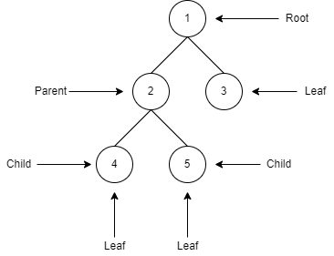
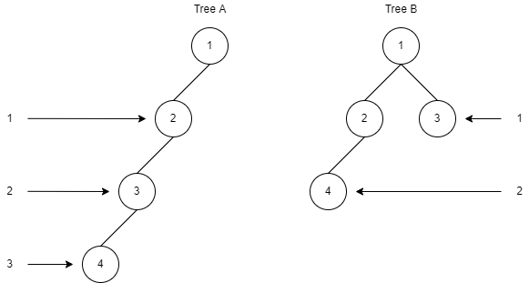
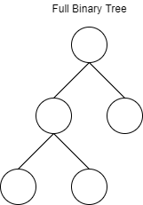
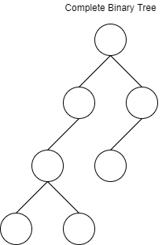
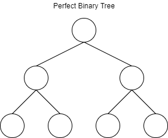
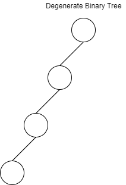

## Definisi
*Binary tree* (*BST*) adalah struktur data yang berbentuk nonlinier yang membentuk struktur seperti pohon dan terbentuk dari sekumpulan *node*. Pada *binary tree*, properti dari *node* berisi data, *pointer left*, dan *pointer right* (kita akan melihat kegunaan dari ketiga properti ini nanti!). Pada *binary tree*, sebuah *parent node* hanya boleh memiliki maksimal dua buah *child node*.

## Terminologi Pada *Tree*
Pada *binary tree*, ada beberapa terminologi yang harus kita pahami, diantaranya:

1. Node : Merupakan titik yang membentuk sebuah *tree*
2. Root : Merupakan *node* yang terletak paling atas pada *tree*
3. Parent : Merupakan *node* selain *root* yang menghubungkan *node* lain, serta tidak terletak pada dasar dari *tree*
4. Child : Merupakan *node* yang membawahi *parent*
5. Leaf Node : Merupakan *node* yang tidak memiliki *child*
6. Internal Node : Merupakan *node* yang memiliki setidaknya satu *child node*

Berikut ini, ilustrasi dari terminologi di atas

\
Keterangan :
1. *Node* 1 adalah *root node*
2. *Node* 2 adalah *parent node* untuk *node* 4 dan 5. *Node* 2 juga berperan sebagai *internal node*
3. *Node* 4 dan 5 adalah *child node* dari *node* 2
4. *Node* 3, 4, dan 5 adalah *leaf* node

Gambar berikut akan kita gunakan untuk membahas tinggi (*height*) dan kedalaman (*depth*) dari sebuah *tree*
\
Secara umum, **tinggi dari sebuah *tree* diukur dari *root node* ke *leaf node* terjauh**. Tinggi maksimal dari sebuah *binary tree* dengan *n* buah *node* adalah sebesar *n-1*.
*Tree A* memiliki tinggi sebesar 3 satuan dihitung dari *root node*, sedangkan *Tree B* memiliki tinggi sebesar 2 satuan dihitung dari *root node*. Dari contoh ini, bisa kita simpulkan bahwa *binary tree* dengan 4 buah *node* memiliki tinggi maksimal sebesar 3 satuan.

**Kedalaman dari sebuah *binary tree* diukur dari *root node* ke *node* yang ditentukan**. Pada *Tree A*, kedalaman dari *node 2* adalah 1 satuan, dan kedalaman dari *node 3* adalah 2 satuan. Sedangkan pada *Tree B*, kedalaman dari *node 2* dan *node 3* sama-sama 1 satuan.

## Ragam *Tree*
Terdapat beberapa ragam *binary tree*, diantaranya :

1. Full Binary Tree\
    Merupakan *binary tree* yang memiliki **dua** atau **tidak sama sekali** *child node*\
    
2. Complete Binary Tree\
    Merupakan *binary tree* di mana pada setiap tingkat (*level*) terdapat setidaknya satu buah *node*\
    
3. Perfect Binary Tree\
    Merupakan *binary tree* yang setiap *internal node*-nya memiliki tepat dua buah *child node*\
    
4. Degenerate Binary Tree\
    Merupakan *binary tree* yang tiap *internal node*-nya hanya memiliki sebuah *child node*\
    

## Perbedaan *Binary Tree* Dan *Binary Search Tree*
Walau sekilas terlihat mirip, ternyata ada perbedaan antara *binary tree* dengan *binary search tree*, diantaranya:
| **Pembeda** | **Binary Tree**                                                                                                          | **Binary Sarch Tree**                                                                                                                          |
|-------------|--------------------------------------------------------------------------------------------------------------------------|------------------------------------------------------------------------------------------------------------------------------------------------|
| Struktur    | Tidak ada aturan ketika melakukan *insert* pada *tree*                                                                   | Nilai *node* pada *subtree* sebelah kiri selalu lebih kecil dari pada nilai *node* pada *subtree* sebelah kanan ketika kita melakukan *insert* |
| Operasi     | Layaknya *linked list*, *binary tree* juga memiliki operasi *insert*, *delete*, juga *search*                            | Operasi yang dimiliki sama seperti *binary tree*, hanya saja performa pada *binary search tree* lebih optimal karena sudah tersturktur.        |
| Jenis       | Ada beberapa jenis dari *binary tree*, diantaranya *full binary tree*, *complete binary tree*, dan *perfect binary tree* | Ada beberapa jenis dari *binary search tree*, diantaranya *AVL tree*, *red black tree*, dan *T tree*                                           |

Referensi :
1. https://www.upgrad.com/blog/5-types-of-binary-tree/
2. https://www.geeksforgeeks.org/relationship-number-nodes-height-binary-tree/
3. https://stackoverflow.com/questions/2603692/what-is-the-difference-between-tree-depth-and-height
4. https://www.upgrad.com/blog/binary-tree-vs-binary-search-tree/