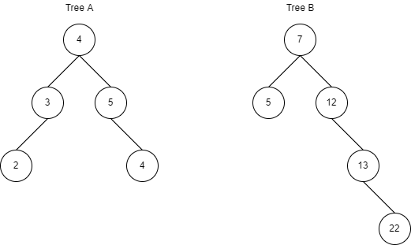

## Definisi
*Binary search tree* (*BST*) adalah salah satu ragam dari *binary tree* yang memiliki karakteristik di mana nilai pada *node* sebelah kiri selalu lebih kecil dari *node* sebelah kanan. Dua *tree* di bawah merupakan ilustrasi dari *binary search tree*.


## Operasi Pada *Binary Search Tree*
Ada beberapa operasi yang dapat dilakukan pada *binary search tree*, seperti *insert*, *delete*, dan *traverse/traversal*. Kebanyakan sumber menuliskan operasi-operasi ini menggunakan rekursi, jadi penting bagi kamu untuk mengerti bagaimana cara kerja fungsi rekursi.

### Insert
Algoritma untuk melakukan *insert* pada *BST* adalah sebagai berikut:
1. Mulai dari *root node*
2. Bandingkan nilai dari *node* yang ingin di-*insert* dengan nilai pada *root*. Jika nilai dari *node* yang ingin di-*insert* lebih besar daripada nilai dari *node*, lakukan *insert* pada sebelah kiri dan sebaliknya.
3. Periksa apakah *pointer* kiri dan *pointer* kanan kosong. Jika kosong lakukan *insert* pada *pointer* tersebut, dan jika tidak lakukan *insert* secara rekursif.

Berikut adalah implementasi dari algoritma di atas.
```
class BinarySearchTree:
    # method __init__ digunakan untuk membangun Node
    def __init__(self, data: int = None):
        self.data = data
        self.left = None
        self.right = None

    def insert(self, new_data):
        if self.data is None:
            # menginisasi root jika belum ada node sama sekali
            self.data = new_data
        elif new_data < self.data:
            if self.left is None:
                self.left = BinarySearchTree(new_data)
            else:
                # memasukkan node baru di sebelah kiri secara
                # rekursif melalui atribut left
                self.left.insert(new_data)
        else:
            if self.right is None:
                self.right = BinarySearchTree(new_data)
            else:
                # memasukkan node baru di sebelah kanan secara
                # rekursif melalui atribut right
                self.right.insert(new_data)
```
Misalkan kita ingin membangun *BST* dengan nilai sebagai berikut : `4, 5, 3, 7`. Ilustrasi dari membangun *BST* tersebut adalah sebagai berikut.


### Traversal
*Traversal* adalah cara untuk mengunjungi *node* pada *tree*